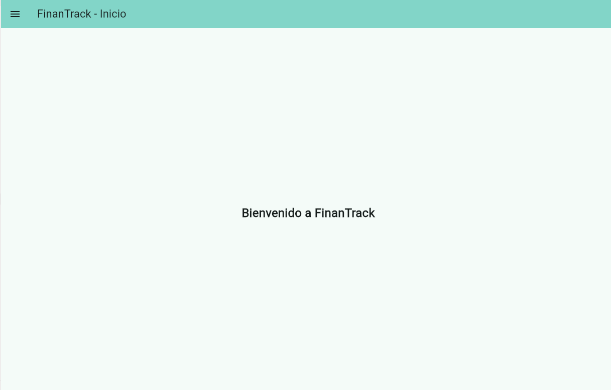
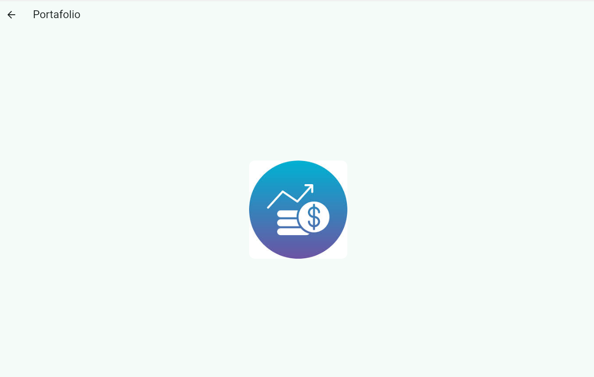
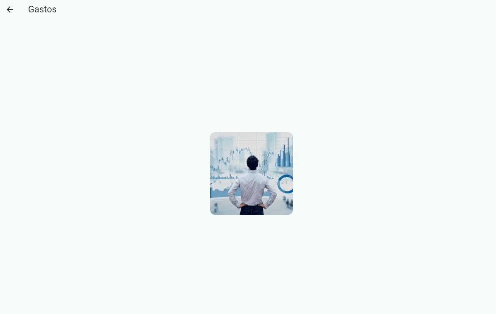
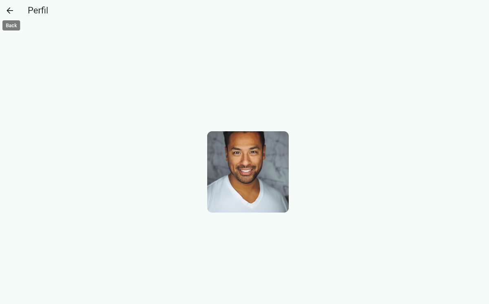
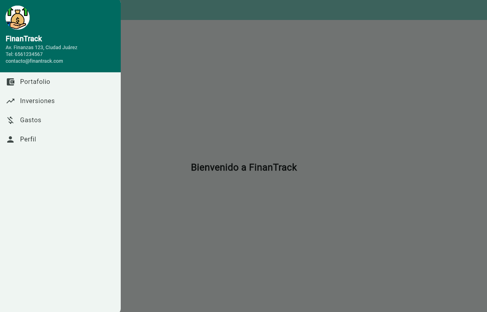
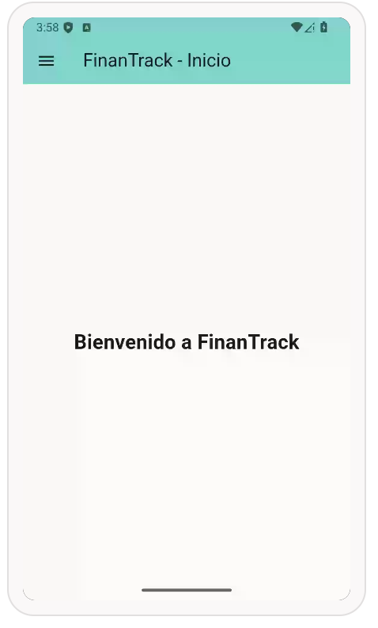
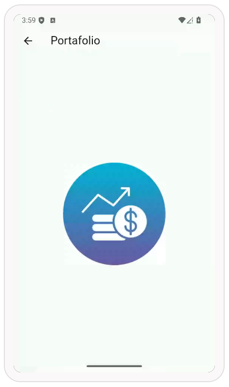
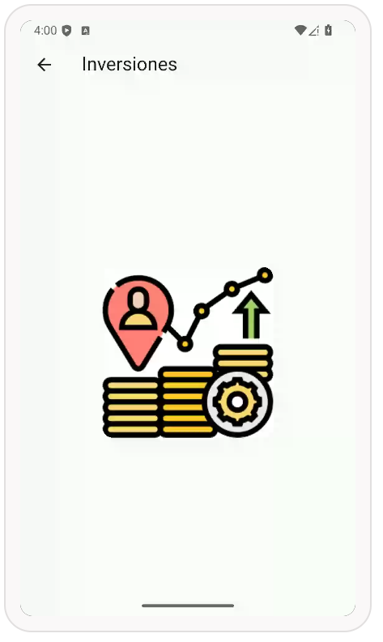
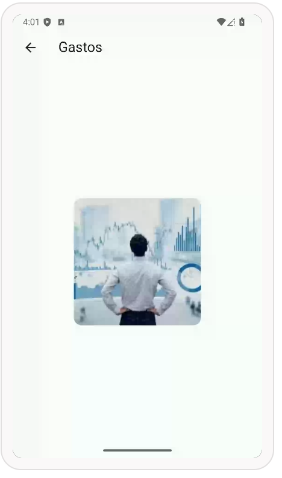
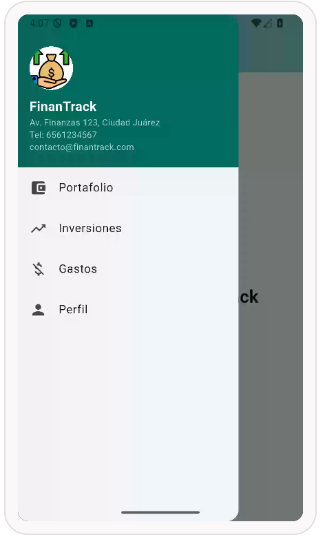

# prompt
Crea una aplicación en Flutter (Dart) en un solo archivo llamado main.dart.
La aplicación debe representar una empresa financiera llamada "FinanTrack".
Debe incluir un Scaffold con un Drawer (menú lateral).
El Drawer debe tener un encabezado con:
* Imagen de avatar desde internet relacionada con finanzas (empresa o gráfico financiero)
* Nombre de la empresa: FinanTrack
* Dirección: Av. Finanzas 123, Ciudad
* Teléfono: 6561234567
* Correo: [contacto@finantrack.com](mailto:contacto@finantrack.com)
Debajo del encabezado, incluir 4 opciones usando ListTile, cada una con icono, texto y acción de navegación:
1. Portafolio (icono: account_balance_wallet)
2. Inversiones (icono: trending_up)
3. Gastos (icono: money_off)
4. Perfil (icono: person)
Cada opción debe navegar a una pantalla diferente utilizando rutas nombradas definidas en MaterialApp.
Las rutas deben ser:
* '/portafolio'
* '/inversiones'
* '/gastos'
* '/perfil'
Cada pantalla debe contener:
* Un AppBar con el nombre de la sección
* Un cuerpo con una imagen centrada de 200x200 píxeles
* La imagen debe cargarse desde internet y estar relacionada con el tema (finanzas, inversión, dinero, etc.)
La navegación debe realizarse utilizando Navigator.pushNamed.
El diseño debe seguir Material Design, ser limpio y funcional.
Todo el código debe estar en un solo archivo main.dart, completamente funcional y listo para ejecutarse en DartPad.

# myweb

# android

